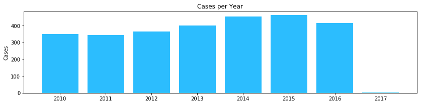
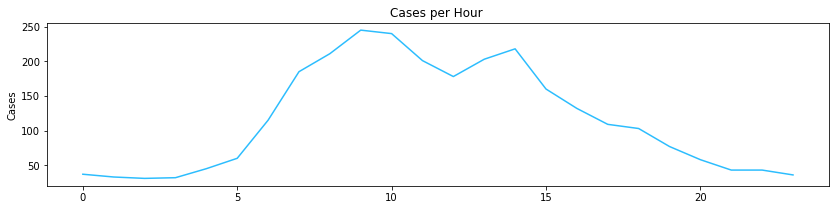
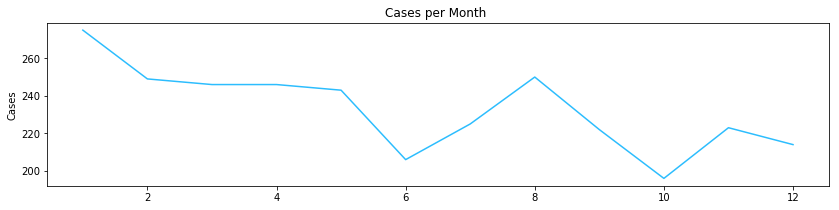
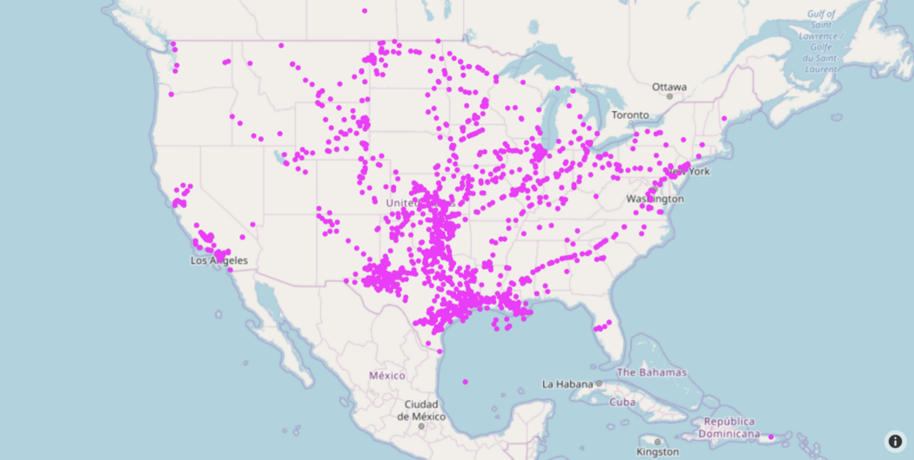
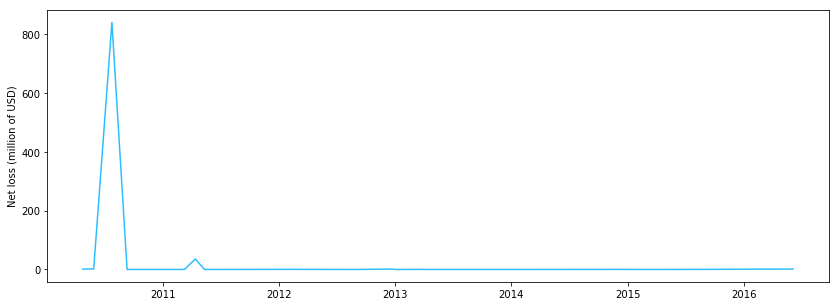

# Tracing Oil Spills
A journey from oil leakage to applying AI to predict equipment failures.

## Dataset

[Oil Pipeline Accidents, 2010-Present](https://www.kaggle.com/usdot/pipeline-accidents)

**Location:** `database.csv`

**Description:** This database includes a record for each oil pipeline leak or spills reported to the Pipeline and Hazardous Materials Safety Administration since 2010. These records include the incident date and time, operator and pipeline, cause of the incident, type of hazardous liquid and quantity lost, injuries and fatalities, and associated costs.

[Predictive Equipment Failures](https://www.kaggle.com/c/equipfails/data)

**Location:** `equipfails`

**Description:** Predict downhole equipment failures using sensor data

**Features Summary:** There are two types of sensor columns in these data sets:
* `measure columns` - These columns are a single measurement for the sensor.
* `histogram bin columns` - These columns are a set of 10 columns that are different bins of a sensor that show its distribution over time. 

# Motivation

In the job searching process, I found that many companies in my area looking for data analysts having knowledge of oil and gas. My background is mostly in mathematics, so I decided to go on an adventure along the oil pipeline.

One thing that I noticed is oil and gas is a big industry with old infrastructure. In 2014, [Inside Energy](http://insideenergy.org/2014/08/01/half-century-old-pipelines-carry-oil-and-gas-load/) reported that 45% of the U.S. crude oil pipeline was more than 50 years old. Some pipeline even laid in and before the 1920s is still in operation. That ancient, aging infrastructure can cause a catastrophe, such as oil leakage, which would affect company revenue, environment, and people in the surrounding area.

So what is the culprit of all of these oil leakages? Let’s dive into the oil!

## Oil Pipeline Incidents, 2010-2017

The [data](https://www.kaggle.com/usdot/pipeline-accidents) includes a record for each oil pipeline leakages or spills reported to the Pipeline and Hazardous Materials Safety Administration from 2010 to 2017. There were 2795 leakages in the spans of more than 7 years. There are 46 features describe each incident. Some of the noteworthy ones are: *incident date and time*, *operator name*, *cause of the incident*, *type of hazardous liquid*, *quantity lost*, *injuries and fatalities*, and *associated costs*.

The data is rich and descriptive. I picked up a few interesting features and started from here.

### How are incidents distributed by year, month, and hour of the day?

Observe that 2017 has incomplete data. The highest peak was in 2015 with 462 cases.

There is no time-zone adjusted here but I can safely assume that most of the cases happened during business hours.

Interestingly, in December there were only a few cases (212). But in January, it dramatically increased (275). I wonder if there was a trend here due to the operating transition from the old to the new year, or, it might just be a random series of leakages that happened in January?

### Where are these accidents located?

According to the geo graph that I created by `plotly`, it seems to me that the leakages happened along corresponding pipelines. Texas has the most incidents among all states (1004 cases). This isn't really a surprise since [Texas]() is the largest domestic producer of oil in the U.S. I assumed that Texas would lose the most money but that wasn't the case...

### What is the net loss of each state?

Let's take a look at the top 3 states in terms of losing money:

**3rd place belongs to Texas** with 1004 accidents, 135,580 barrels lost, and the net loss of 184.75 million.

**2nd place belongs to California** with 153 accidents and 3,390 barrels lost, and the net loss of 192 million.

And the winner is... **Michigan** with 29 accidents, 5,355 barrels lost, and a net loss of **834 million**.

My assumption was completely wrong, the number of accidents is *not* correlated with the net loss. Moreover, the number of barrels lost does not take account of where the money went.

The missing pieces of the puzzle are other features, which I naively thought that they were unimportant. The other features I should have considered are:

* Pipeline shutdown
* Property damage costs
* Lost commodity costs
* Emergency response costs
* Environmental remidiation costs

### What really happened in Michigan?

The 2010 spike that you see took account for 95% of the total net loss in Michigan, and 36% of the total net loss in the US in 7 years period! A little research shows that this incident was the [Kalamazoo River Oil Spill](https://en.wikipedia.org/wiki/Kalamazoo_River_oil_spill) on July 25th. When a pipeline operated by **Enbridge** (Line 6B) burst and flowed into **Talmadge Creek**, it was left unnoticed for 18 hours. The crew misconstrued the anomalous pressure data and thought that it was caused by bubbles in the pipeline. Consequently, they restarted the line twice and made the oil escape much faster.

The list of the top 10 incidents in Michigan will give you a better picture of how much damage the Kalamazoo River oil spill has caused to the state.

|index|Accident City|datetime           |Cause Category             |Unintentional Release (Barrels)|Intentional Release (Barrels)|Liquid Recovery (Barrels)|Net Loss (Barrels)|All Costs|
|-----|-------------|-------------------|---------------------------|-------------------------------|-----------------------------|-------------------------|------------------|---------|
|194  |MARSHALL     |2010-07-25 17:58:00|MATERIAL/WELD/EQUIP FAILURE|20082.0                        |0.0                          |18245.0                  |1837.0            |840526118|
|457  |DANSVILLE    |2011-04-13 18:58:00|MATERIAL/WELD/EQUIP FAILURE|9000.0                         |0.0                          |6643.0                   |2357.0            |35728903 |
|140  |CONSTANTINE  |2010-05-29 12:34:00|MATERIAL/WELD/EQUIP FAILURE|2121.0                         |0.0                          |1001.0                   |1120.0            |1965246  |
|2562 |BANGOR       |2016-06-03 12:00:00|OTHER OUTSIDE FORCE DAMAGE |280.0                          |0.0                          |280.0                    |0.0               |1418000  |
|1049 |WAYNE        |2012-12-21 11:00:00|INCORRECT OPERATION        |3.0                            |0.0                          |3.0                      |0.0               |1216083  |
|103  |SAMARIA      |2010-04-25 09:00:00|MATERIAL/WELD/EQUIP FAILURE|91.0                           |0.0                          |79.0                     |12.0              |1103967  |
|1179 |TEMPERANCE   |2013-04-01 17:25:00|MATERIAL/WELD/EQUIP FAILURE|2.39                           |0.0                          |1.0                      |1.39              |325409   |
|739  |STERLING     |2012-02-15 14:15:00|MATERIAL/WELD/EQUIP FAILURE|20.0                           |0.0                          |20.0                     |0.0               |300000   |
|2249 |TEMPERANCE   |2015-09-13 18:23:00|MATERIAL/WELD/EQUIP FAILURE|22.0                           |0.0                          |22.0                     |0.0               |274700   |
|1889 |MANISTIQUE   |2014-12-08 09:30:00|MATERIAL/WELD/EQUIP FAILURE|0.0                            |0.0                          |0.0                      |0.0               |214500   |

### What is the culprit of oil leakages?

**Equipment failure** is the short answer to this question. Human capability is very limited when it comes to interpreting data with many parameters. Reading data manually can lead to overlooking the anomaly and caused heavy damage to the business. In fact, material/weld/equipment failures contributed to 53% of the loss of all causes.

|FIELD1|Cause Category             |Number of Cases|Loss (million USD)|Fatalities|
|------|---------------------------|---------------|------------------|----------|
|      |                           |               |                  |          |
|0     |ALL OTHER CAUSES           |118            |110.82            |4.0       |
|1     |CORROSION                  |592            |395.33            |0.0       |
|2     |EXCAVATION DAMAGE          |97             |93.1              |1.0       |
|3     |INCORRECT OPERATION        |378            |106.14            |0.0       |
|4     |MATERIAL/WELD/EQUIP FAILURE|1435           |1243.77           |1.0       |
|5     |NATURAL FORCE DAMAGE       |118            |220.35            |0.0       |
|6     |OTHER OUTSIDE FORCE DAMAGE |57             |161.6             |4.0       |
